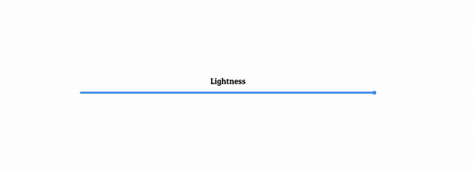

# Lightness-js
Lightness, It is developed using JavaScript, Css and Html.

 

##### Table of Contents  
[Features](#features)  

  

## Features
- You can adjust the screen brightness by dragging the button to the right or left with a mouse or touch screen.
 
- The brightness change is instantly reflected on the browser screen.  

 
 

